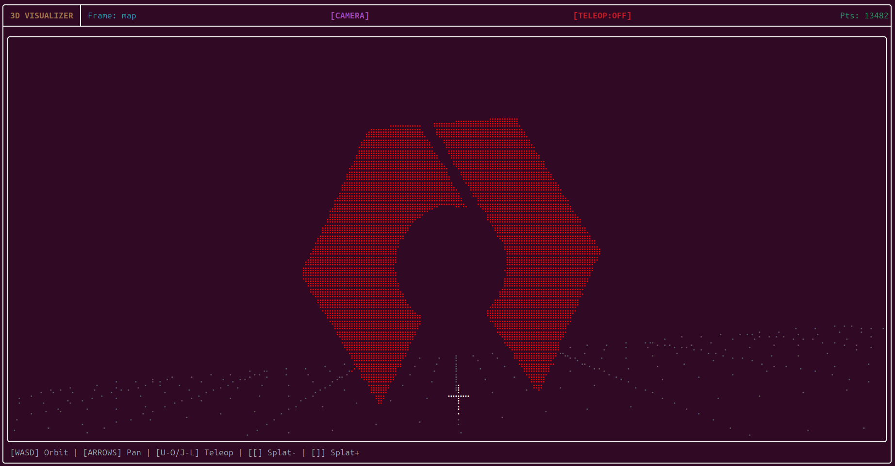

# Terminal PCL Visualizer

A high-performance, real-time 3D Point Cloud visualizer for your terminal. Built with ROS 2 and [FTXUI](https://github.com/ArthurSonzogni/ftxui), it allows you to visualize point clouds and control robots directly from your CLI with near-zero latency.



## Features

-   **High-Density 3D Rendering**: Real-time projection of point clouds using Braille characters for maximum resolution.
-   **Adaptive Splatting**: Dynamically fills gaps in sparse point clouds based on depth to provide a solid scene structure from all angles.
-   **Integrated Teleop**: Built-in keyboard teleoperation (compatible with `teleop_twist_keyboard` layout).
-   **Z-Buffering**: Correct depth occlusion ensures closer points properly hide points behind them.
-   **Full-Screen Adaptive UI**: Automatically scales the 3D canvas to fit your terminal window.
-   **Zero-Latency Performance**: Optimized C++ rendering pipeline with pre-calculated trigonometry and memory-efficient buffering.

## Installation

### Prerequisites
-   ROS 2 (Humble or newer recommended)
-   C++17 compiler
-   `sensor_msgs`, `geometry_msgs`, `rclcpp`

### Build
```bash
cd ~/your_ws/src
git clone <repository_url>
cd ..
colcon build --packages-select terminal_pcl_visualizer --cmake-args -DCMAKE_BUILD_TYPE=Release
source install/setup.bash
```

## Usage

Run the visualizer node:
```bash
ros2 run terminal_pcl_visualizer visualizer_node
```

### Parameters
-   `topic`: The PointCloud2 topic to subscribe to (default: `/points`).
-   `max_points`: Maximum points to render per frame for performance (default: `20000`).
-   `enable_teleop`: Enable `/cmd_vel` publishing (default: `false`).
-   `cmd_vel_topic`: The topic for teleop commands (default: `/cmd_vel`).

Example with teleop enabled:
```bash
ros2 run terminal_pcl_visualizer visualizer_node --ros-args -p enable_teleop:=true -p topic:=/camera/points
```

## Controls

### Camera Control
| Key | Action |
| :--- | :--- |
| **W / S** | Orbit Up / Down (Pitch) |
| **A / D** | Orbit Left / Right (Yaw) |
| **P / O** | Roll Clockwise / Counter-clockwise |
| **+ / -** | Zoom In / Out |
| **Arrows** | Pan Left/Right/Up/Down |
| **PgUp/PgDn**| Move Forward / Backward |
| **1 / 2 / 3**| Camera Presets (front / side / top) |
| **R** | Reset Camera & Splatting |
| **C** | Toggle Camera Mode (Camera-centric vs. World-centric) |

### Robot Teleop (if enabled)
| Key | Action |
| :--- | :--- |
| **U / I / O** | Forward-Left / Forward / Forward-Right |
| **J / K / L** | Spin Left / Stop / Spin Right |
| **M / , / .** | Backward-Left / Backward / Backward-Right |
| **Y / H** | Increase / Decrease Speed |

### Visual Quality
| Key | Action |
| :--- | :--- |
| **[** | Decrease Splatting (less gap filling) |
| **]** | Increase Splatting (more gap filling) |
| **Q / Esc** | Quit |

## License

This software is licensed under the **BSD 3-Clause License**.

```text
Copyright (c) 2026, Nathan Shankar.
All rights reserved.

Redistribution and use in source and binary forms, with or without
modification, are permitted provided that the following conditions are met:

1. Redistributions of source code must retain the above copyright notice, this
   list of conditions and the following disclaimer.

2. Redistributions in binary form must reproduce the above copyright notice,
   this list of conditions and the following disclaimer in the documentation
   and/or other materials provided with the distribution.

3. Neither the name of the copyright holder nor the names of its
   contributors may be used to endorse or promote products derived from
   this software without specific prior written permission.

THIS SOFTWARE IS PROVIDED BY THE COPYRIGHT HOLDERS AND CONTRIBUTORS "AS IS"
AND ANY EXPRESS OR IMPLIED WARRANTIES, INCLUDING, BUT NOT LIMITED TO, THE
IMPLIED WARRANTIES OF MERCHANTABILITY AND FITNESS FOR A PARTICULAR PURPOSE ARE
DISCLAIMED. IN NO EVENT SHALL THE COPYRIGHT HOLDER OR CONTRIBUTORS BE LIABLE
FOR ANY DIRECT, INDIRECT, INCIDENTAL, SPECIAL, EXEMPLARY, OR CONSEQUENTIAL
DAMAGES (INCLUDING, BUT NOT LIMITED TO, PROCUREMENT OF SUBSTITUTE GOODS OR
SERVICES; LOSS OF USE, DATA, OR PROFITS; OR BUSINESS INTERRUPTION) HOWEVER
CAUSED AND ON ANY THEORY OF LIABILITY, WHETHER IN CONTRACT, STRICT LIABILITY,
OR TORT (INCLUDING NEGLIGENCE OR OTHERWISE) ARISING IN ANY WAY OUT OF THE USE
OF THIS SOFTWARE, EVEN IF ADVISED OF THE POSSIBILITY OF SUCH DAMAGE.
```
